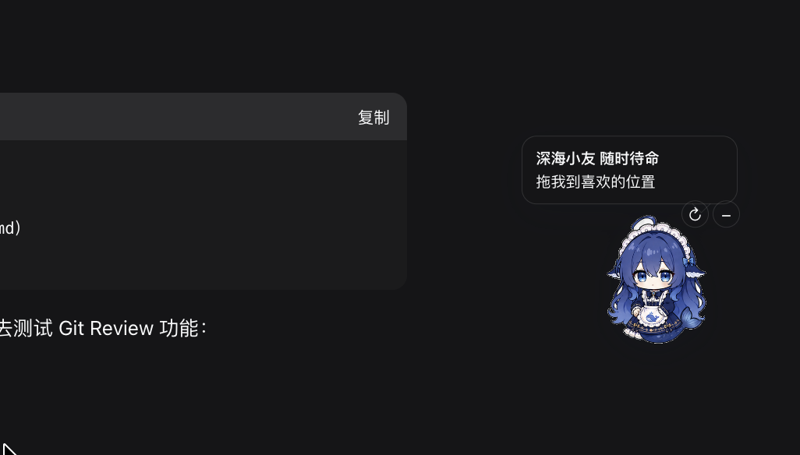
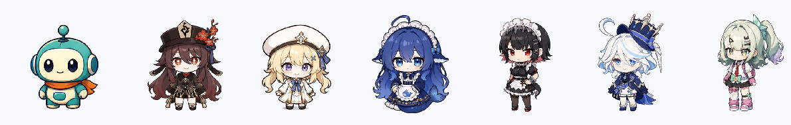

# DSH WebUI Pets — Codex-style desktop pets for DeepSeek Harness Web UI

# DSH WebUI Pets —— 类似 Codex 的 DeepSeek Harness Web UI 桌宠

English version / 英文版

## Overview

DSH WebUI Pets is a collection of Codex-like draggable desktop companions for the DeepSeek Harness Web UI. It currently includes Doki, Crimson Flower, Blue Ribbon, and Deep Sea. The package is tagged [dsh-plugin](https://github.com/topics/dsh-plugin) and renders inside the Web UI instead of opening a native desktop window.

桌宠总览 / Desktop pets overview:

The plugin lives at [packages/client/ui-desktop-pet](packages/client/ui-desktop-pet). It registers into the shell.overlay slot and provides draggable, minimizable pets with 12-frame sprite sheets. Use the ↻ control to cycle pets; the selection and position are persisted in browser local storage.

## Pet artwork specification

New pets should use a transparent RGBA PNG sprite sheet sized 1448 × 1086 pixels. The sheet is a 4 × 3 grid of 362 × 362 pixel frames, numbered left to right and top to bottom. Use a lowercase kebab-case filename ending in -sprite.png, keep all poses inside their own cells, and keep the character scale and feet baseline consistent.

The complete English and Chinese preparation guide, frame order, naming rules, runtime mapping, and integration checklist are in [docs/pet-artwork-spec.md](docs/pet-artwork-spec.md).

## Install into dsh

Copy packages/client/ui-desktop-pet into a dsh checkout, add its workspace reference to the client TypeScript solution, add the package to the Web bundle dependencies, and register its dsh.client row in the Web composition patch. The package README documents the runtime behavior and current limitations.

## Assets and license

The four transparent sprite sheets were generated from user-provided character references. Confirm derivative-work and redistribution rights before redistributing the character assets. The plugin source is MIT licensed.

---

## 中文翻译

DSH WebUI Pets 是一组面向 DeepSeek Harness Web UI 的、类似 Codex 的可拖拽桌宠。目前包含 Doki、赤花小友、蓝缎小友和深海小友。仓库已加入 [dsh-plugin](https://github.com/topics/dsh-plugin) 话题，桌宠运行在 Web UI 内，不会打开原生桌面窗口。

上方截图是桌宠在 Web UI 中的实际效果；下方总览图展示当前四个桌宠：

插件位于 [packages/client/ui-desktop-pet](packages/client/ui-desktop-pet)，注册到 shell.overlay 槽位，支持拖拽、缩小和 12 帧组图动画。点击 ↻ 可以循环切换桌宠，选择和位置会保存到浏览器本地存储。

## 接入 dsh

将 packages/client/ui-desktop-pet 复制到 dsh 源码仓库，加入客户端 TypeScript solution、Web bundle 依赖以及 Web composition patch 中的 dsh.client 注册，即可接入。运行行为和当前限制详见插件目录中的 README。

## 桌宠图片制作规范

新增桌宠请使用透明背景的 RGBA PNG 组图，尺寸为 1448 × 1086 像素，按 4 列 × 3 行排列，每帧 362 × 362 像素。文件名使用小写 kebab-case，并以 -sprite.png 结尾；每个姿势必须留在自己的单元格内，角色比例和脚部基线要保持一致。

完整的中英文图片制作说明、帧顺序、命名规则、运行时映射和接入检查清单见 [docs/pet-artwork-spec.md](docs/pet-artwork-spec.md)。

## 素材与许可证

四套透明组图根据用户提供的角色参考图生成。重新分发角色素材前，请确认相应的二创和分发授权；插件源代码采用 MIT 许可证。
